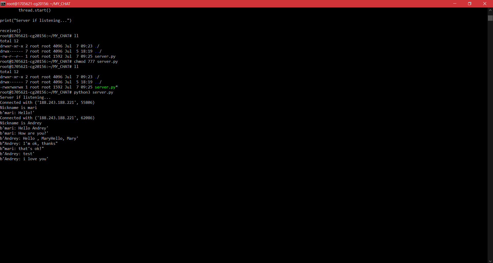
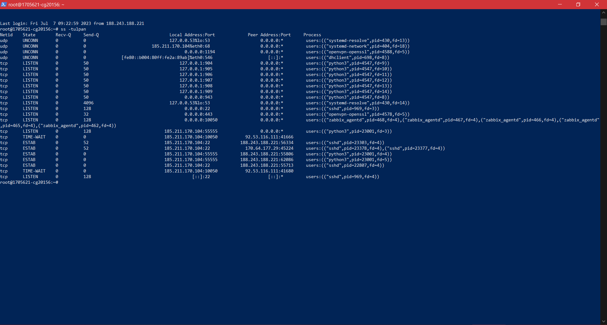
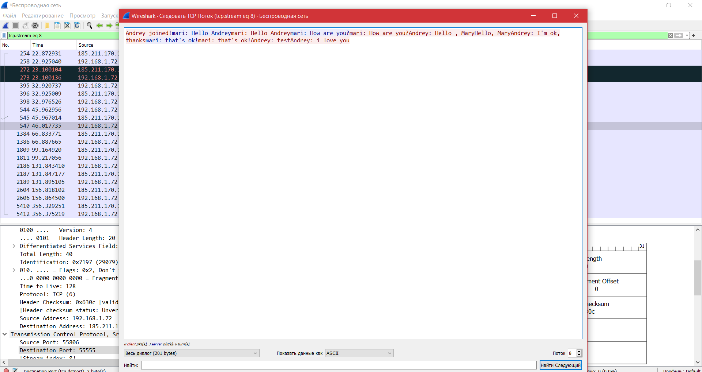

# Домашнее задание 6

## 1. Код написанного сервера

```
import socket
import threading

# Хост и порт, на котором лежит файл с написанным сервером для подключения к нему
host = '185.211.170.104'
port = 55555

# Запуск сервера по протоколу IPv4
server = socket.socket(socket.AF_INET, socket.SOCK_STREAM)
server.bind((host, port))
server.listen()

# Словарь с пользователями (адрес и ник)
users = {}

# Функция рассылки сообщений для всех пользователей
def broadcast(message):
    for client in users:
        client.send(message)

# Функция приема сообщений от пользователей
def handle(client):
    while True:
        try:
            # Broadcasting Messages
            message = client.recv(1024)
            broadcast(message)
            print(message)
        except:
            # Removing And Closing Clients
            broadcast('{} left!'.format(users.get(client)).encode(encoding='utf-8'))
            users.pop(client)
            break

# Функция, которая постоянно слушает подключения и новые сообщения
def receive():
    while True:
        # Accept Connection
        client, address = server.accept()
        print("Connected with {}".format(str(address)))

        # Request And Store Nickname
        client.send('NICK'.encode(encoding='utf-8'))
        nickname = client.recv(1024).decode(encoding='utf-8')
        users[client] = nickname

        # Print And Broadcast Nickname
        print("Nickname is {}".format(nickname))
        broadcast("{} joined!".format(nickname).encode(encoding='utf-8'))
        client.send('Connected to server!'.encode(encoding='utf-8'))

        # Start Handling Thread For Client
        thread = threading.Thread(target=handle, args=(client,))
        thread.start()

print("Server if listening...")

receive()
```

## 2. Cкриншот работающего чата



## 3. Отследите сокеты



## 4. Перехватите трафик своего чата в Wireshark и cшейте сессию


